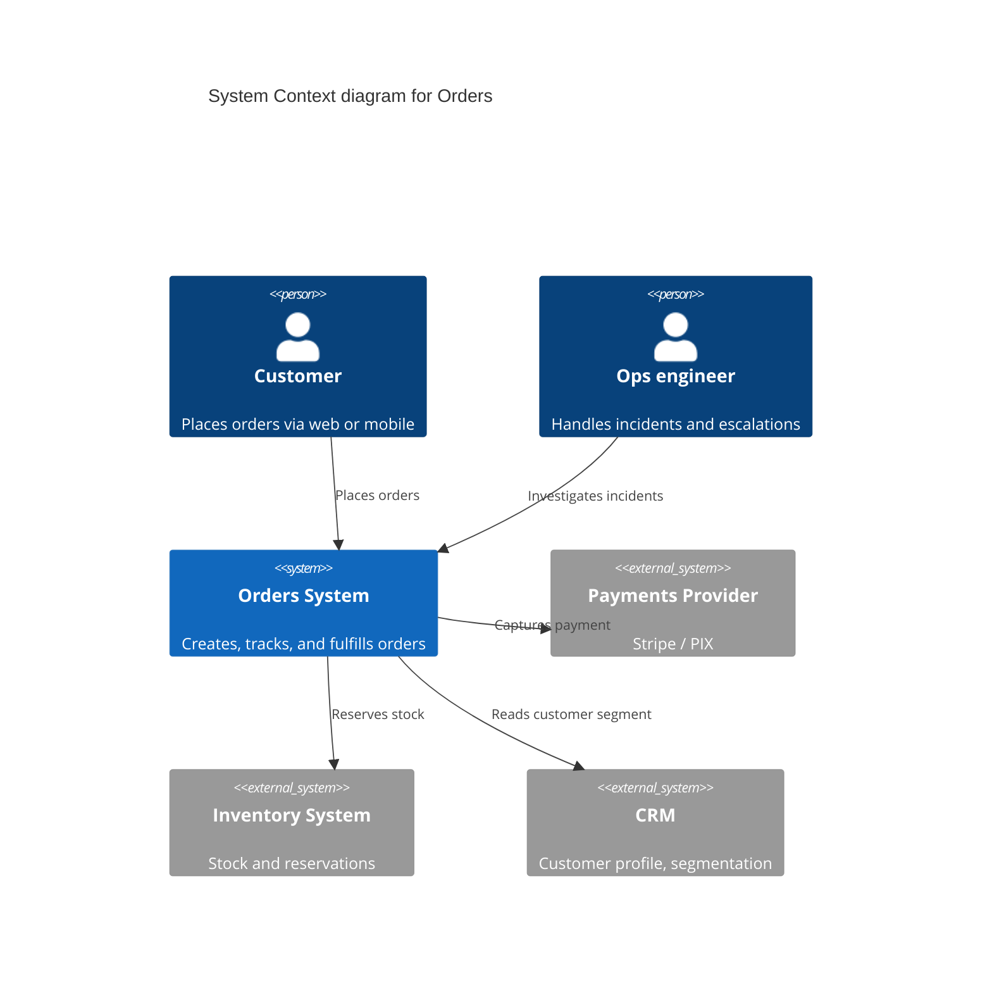
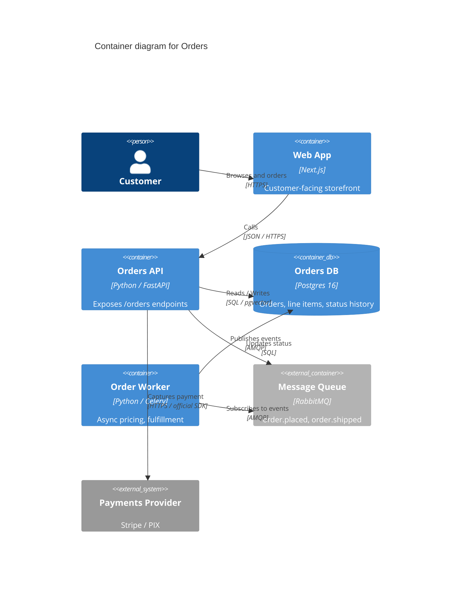
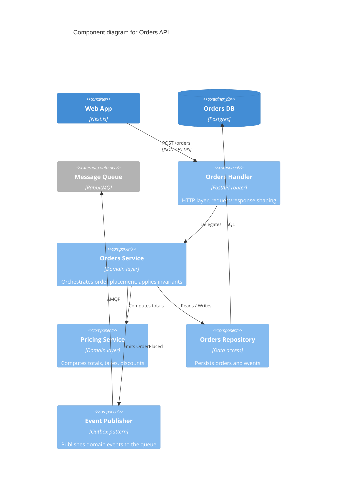

# C4 diagrams with Mermaid

Three useful levels. Use Mermaid because it renders natively in GitHub and most Markdown viewers — no external assets.

---

## Level 1: Context

Who uses the system and what external systems it talks to. The audience is Product and stakeholders. Keep it abstract — no boxes for internal services.

Rules:

- One `System` per box (yours). Multiple `System_Ext` for third parties.
- `Person` for human roles.
- Each `Rel` includes the verb and the data direction.
- No technology labels at Level 1 — that's Level 2.

---

## Level 2: Container

The internal pieces of your system. The audience is Product and Engineering. Each container is a separately deployable unit: API, worker, database, queue, web app, mobile app.

Rules:

- Include the technology choice in each container (`Postgres 16`, `Python / Celery`, `Next.js`).
- `Rel` includes the protocol (`HTTPS`, `gRPC`, `AMQP`, `SQL`).
- Show data direction by where the arrow originates.
- Keep it under 12 containers — beyond that, split into multiple Level 2 diagrams by bounded context.

---

## Level 3: Component (optional)

The internal structure of one container. The audience is Engineering. Useful when the container has > 5 distinct components doing materially different things.

Rules:

- Skip this level for features with a simple internal structure.
- Each `Component` is something a developer can grep for (a class, a module, a service object).
- Show how the components inside the container relate to the **external** containers (`web`, `db`, `queue`) at the boundary.

---

## When to skip Mermaid entirely

If the feature is purely a backend job, a refactor, or a config change with no architectural shape change, you don't need a diagram. **The diagram exists to communicate; if there's nothing new to communicate, skip it.**

Section 9 may legitimately read:

> No new architectural elements. See the [Orders System](../orders.md#9-architecture-diagrams) docs for the unchanged Context and Container diagrams.

---

## Common mistakes

- **Diagrams that lie.** Boxes that don't correspond to any actual service or table. The diagram is a contract — every box must exist.
- **Diagrams that duplicate the code.** A diagram listing every class is a class diagram, not a Component diagram. Aggregate at the right level.
- **Tech labels at Level 1.** Level 1 is for stakeholders. They don't care that it's FastAPI.
- **Missing arrows.** Every container should have at least one inbound or outbound relationship. A floating box is a smell.
- **Stale diagrams.** When the architecture changes, the diagram changes in the same PR. Stale diagrams are worse than no diagrams.
