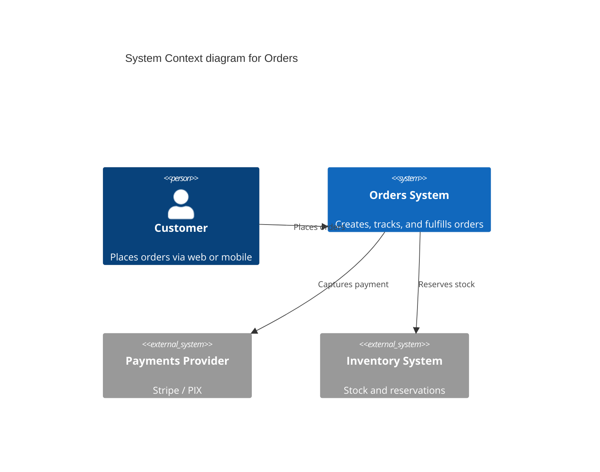
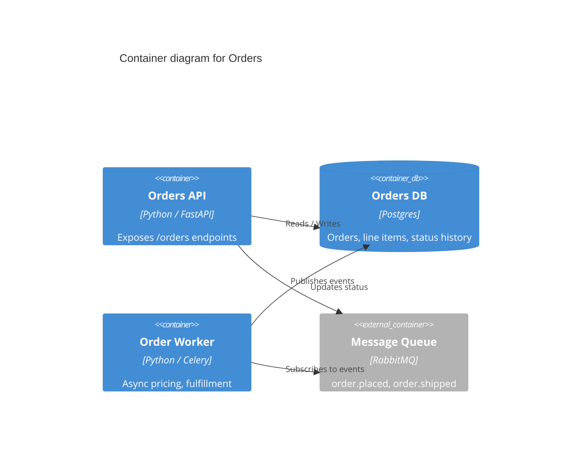

# The 10-section template

Single file. All sections. Horizontal rules between sections. Replace bracketed placeholders with real content.

---

````markdown
# Feature: [Feature Name]

> Generated on: [Date]
> Status: [Draft | Review | Approved]
> Owner: [Team or Person]

---

## Table of Contents

1. [Overview](#1-overview)
2. [Ubiquitous Language Glossary](#2-ubiquitous-language-glossary)
3. [Domain Model](#3-domain-model)
4. [Behavior Specifications](#4-behavior-specifications)
5. [Architecture Decision Records](#5-architecture-decision-records)
6. [Technical Specification](#6-technical-specification)
7. [Observability](#7-observability)
8. [Deployment & Rollback](#8-deployment--rollback)
9. [Architecture Diagrams](#9-architecture-diagrams)
10. [Platform Compatibility](#10-platform-compatibility)

---

## 1. Overview

### Summary
[2-3 sentences describing what this feature does from a business perspective]

### Business Context
[Why this feature exists, what problem it solves]

### Bounded Context
[Which domain / context this feature belongs to]

### Related Contexts
[Other contexts this feature interacts with and the relationship type — Partnership, Customer-Supplier, Conformist, Shared Kernel, Anticorruption Layer, etc.]

---

## 2. Ubiquitous Language Glossary

| Term       | Definition                          | Code Reference                          |
|------------|-------------------------------------|------------------------------------------|
| [Term]     | [Business definition]               | `ClassName`, `method_name`               |
| [Term]     | [Business definition]               | `ClassName`, `method_name`               |

Extract every domain-specific term used in code or conversation. No synonyms — if the business says "Enrollment", the code uses `Enrollment`, the database has `enrollments`, the API has `/enrollments`.

---

## 3. Domain Model

### 3.1 Aggregates

#### [AggregateName]

- **Root Entity:** `ClassName`
- **Entities:** `ChildEntityA`, `ChildEntityB`
- **Value Objects:** `Money`, `Email`, `DateRange`
- **Invariants:**
  - [Business rule that must always be true — e.g., "Total amount = sum of line items"]
  - [Another invariant — e.g., "An order cannot transition from `shipped` back to `pending`"]

### 3.2 Domain Events

| Event             | Trigger                          | Payload                                | Consumers                    |
|-------------------|----------------------------------|----------------------------------------|------------------------------|
| `OrderPlaced`     | New order successfully created    | `order_id`, `customer_id`, `total`     | Inventory, Billing, Email    |
| `OrderShipped`    | Carrier confirms pickup           | `order_id`, `tracking_number`          | Email, Analytics             |

---

## 4. Behavior Specifications

### Feature: [Feature Name]

**As a** [role]
**I want** [capability]
**So that** [benefit]

### Background

- Given [common preconditions that apply to every scenario below]

### Scenario: [Happy path]

- **Given** [context]
- **When** [action]
- **Then** [expected outcome]

### Scenario: [Edge case]

- **Given** [context]
- **When** [boundary action]
- **Then** [expected outcome]

### Scenario: [Error case]

- **Given** [context]
- **When** [invalid action]
- **Then** [error handling behavior]

### Scenario: [Authorization case]

- **Given** [a user without the required permission]
- **When** [they attempt the action]
- **Then** [the system rejects with the documented error]

Generate scenarios for: all happy paths, all edge cases, all error conditions, all permission cases.

---

## 5. Architecture Decision Records

### ADR-001: [Decision Title]

**Status:** [Proposed | Accepted | Deprecated | Superseded]

#### Context
[What is the issue we're seeing that is motivating this decision?]

#### Decision
[What is the change we're proposing or doing?]

#### Consequences

**Benefits:**
- [Positive outcome]
- [Another positive outcome]

**Trade-offs:**
- [What we give up or accept the risk of]

**Impact on Product:**
- [How this affects user experience or business metrics]

### ADR-002: [Next Decision Title]
[Repeat structure as needed]

---

## 6. Technical Specification

### 6.1 Dependencies

| Type         | Name                  | Purpose                                |
|--------------|-----------------------|----------------------------------------|
| Service      | `payments-service`    | Process card and PIX transactions      |
| Database     | Postgres `orders`     | Order state, line items                |
| Queue/Topic  | `order.placed`        | Async order processing                 |
| External API | Stripe                | Card capture                            |

### 6.2 API Contracts

#### POST `/orders`

**Purpose:** Create a new order.

**Request:**
```json
{
  "customer_id": "string — UUID of the customer",
  "items": "array — line items with sku and qty",
  "currency": "string — ISO 4217 code, e.g., 'USD'"
}
```

**Response (Success, 201):**
```json
{
  "order_id": "string — UUID",
  "status": "string — 'pending' | 'placed' | 'shipped' | 'delivered' | 'cancelled'",
  "total_cents": "integer"
}
```

**Response (Error, 422):**
```json
{
  "error": "VALIDATION_FAILED",
  "message": "Human readable message",
  "fields": [{"field": "items", "issue": "must contain at least one item"}]
}
```

### 6.3 Error Handling

| Error Code             | Condition                              | User Message                       | Recovery Action                              |
|------------------------|----------------------------------------|------------------------------------|----------------------------------------------|
| `VALIDATION_FAILED`    | Request body fails schema validation   | "Some fields are invalid."         | Show field-level errors                      |
| `INVENTORY_INSUFFICIENT`| Item out of stock at order time        | "Item X is no longer available."   | Offer substitute or notify when restocked    |
| `PAYMENT_DECLINED`     | Card declined by issuer                | "Your payment could not be processed." | Prompt for a different payment method     |

---

## 7. Observability

### 7.1 Key Metrics

| Metric                          | Type       | Description                          | Alert Threshold                   |
|---------------------------------|------------|--------------------------------------|------------------------------------|
| `orders.created.count`          | Counter    | Successful order creations           | Drop > 50% over 1h                |
| `orders.create.duration_ms`     | Histogram  | End-to-end create duration           | P95 > 2000ms over 5m              |
| `orders.create.errors.count`    | Counter    | Failed creations grouped by error code | Rate > 5% over 5m               |

### 7.2 Important Logs

| Level | Event                       | Fields                                                              | When                                  |
|-------|-----------------------------|---------------------------------------------------------------------|---------------------------------------|
| INFO  | `order.created`             | `order_id`, `customer_id`, `total_cents`, `duration_ms`             | Order persisted                       |
| WARN  | `order.payment.retried`     | `order_id`, `attempt`, `provider`, `error_code`                     | Payment retry triggered               |
| ERROR | `order.create.failed`       | `customer_id`, `error_code`, `error_class`, `duration_ms`           | Order creation failed                 |

### 7.3 Dashboards

- [Order pipeline overview — `grafana.internal/d/orders`](https://grafana.internal/d/orders)
- [Payment provider success rate — `grafana.internal/d/payments`](https://grafana.internal/d/payments)

---

## 8. Deployment & Rollback

### 8.1 Feature Flags

| Flag                          | Purpose                                  | Default | Rollout Strategy            |
|-------------------------------|------------------------------------------|---------|------------------------------|
| `orders.new_pricing_engine`   | Switches to v2 pricing                   | `off`   | 5% → 25% → 50% → 100% over 2 weeks |

### 8.2 Database Migrations

- `0042_add_order_status_column.sql` — adds `status` column with default `'pending'`. **Reversible.**
- `0043_backfill_order_status.sql` — backfills existing rows. **Forward-only** (re-run is idempotent).

### 8.3 Rollback Plan

1. Disable the feature flag `orders.new_pricing_engine`.
2. Verify error rate returns to baseline within 10 minutes.
3. If migration `0043` is implicated, roll back to the prior commit and apply the inverse migration `0042_drop_order_status_column.sql`.
4. Notify `#orders-oncall` channel with the rollback completion timestamp.

### 8.4 Smoke Tests (post-deploy)

- [ ] Create a test order via the staging UI; verify status transitions through `pending → placed`.
- [ ] Verify the `order.created` log appears in the central log store with all mandatory fields.
- [ ] Verify the `orders.created.count` metric increments in the dashboard.
- [ ] Run the rollback-drill script in staging to confirm the rollback plan still works.

---

## 9. Architecture Diagrams

### 9.1 Context Diagram (Level 1)



### 9.2 Container Diagram (Level 2)



### 9.3 Component Diagram (Level 3 — optional)

Add this when the feature has non-trivial internal structure worth illustrating. See `references/c4-diagrams.md` for the Mermaid syntax.

---

## 10. Platform Compatibility

### 10.1 Supported Platforms

| Platform | Versions                                  | Architecture     | Status                              |
|----------|-------------------------------------------|------------------|-------------------------------------|
| Linux    | Ubuntu 22.04+, Debian 12+, RHEL 9+        | x86_64, arm64    | Supported                            |
| macOS    | 13+                                       | x86_64, arm64    | Supported                            |
| Windows  | 10 22H2, 11                               | x86_64           | Supported (native, not WSL)          |
| Docker   | linux/amd64, linux/arm64 — `python:3.12-slim@sha256:...` | — | Supported                  |

### 10.2 Platform-Specific Implementations

| Capability                 | Linux               | macOS                 | Windows                       | Notes                                       |
|----------------------------|---------------------|------------------------|-------------------------------|---------------------------------------------|
| Filesystem watching        | `inotify`            | `FSEvents`             | `ReadDirectoryChangesW`       | Isolated behind `FsWatcher` Protocol         |
| Notifications              | `notify-send`        | `osascript`            | `WinRT.UI.Notifications`      | See `adapters/notifier_*.py`                |
| Temp directory             | `$TMPDIR` / `/tmp`   | `$TMPDIR`              | `%TEMP%`                       | Resolved via `tempfile.gettempdir()`        |

### 10.3 Known Platform-Specific Limitations

- Symlinks require Developer Mode on Windows; the feature falls back to copy when not available.
- Performance characteristic on macOS differs by ~15% on cold-start due to APFS metadata costs.

### 10.4 Installation by Platform

#### Linux
```bash
# package manager or build steps
```

#### macOS
```bash
# brew or build steps
```

#### Windows (PowerShell)
```powershell
# choco / scoop / installer steps
```

#### Docker
```bash
docker pull <image>:<tag>@<digest>
docker run --rm <flags> <image>
```

### 10.5 CI Coverage Matrix

| OS              | Unit | Integration | E2E | Smoke (Docker) |
|-----------------|------|-------------|-----|----------------|
| Ubuntu (latest) | ✓    | ✓           | ✓   | ✓              |
| macOS (latest)  | ✓    | ✓           | —   | —              |
| Windows (latest)| ✓    | ✓           | —   | —              |

`—` = intentionally not covered, with rationale documented in § 10.3.
````
